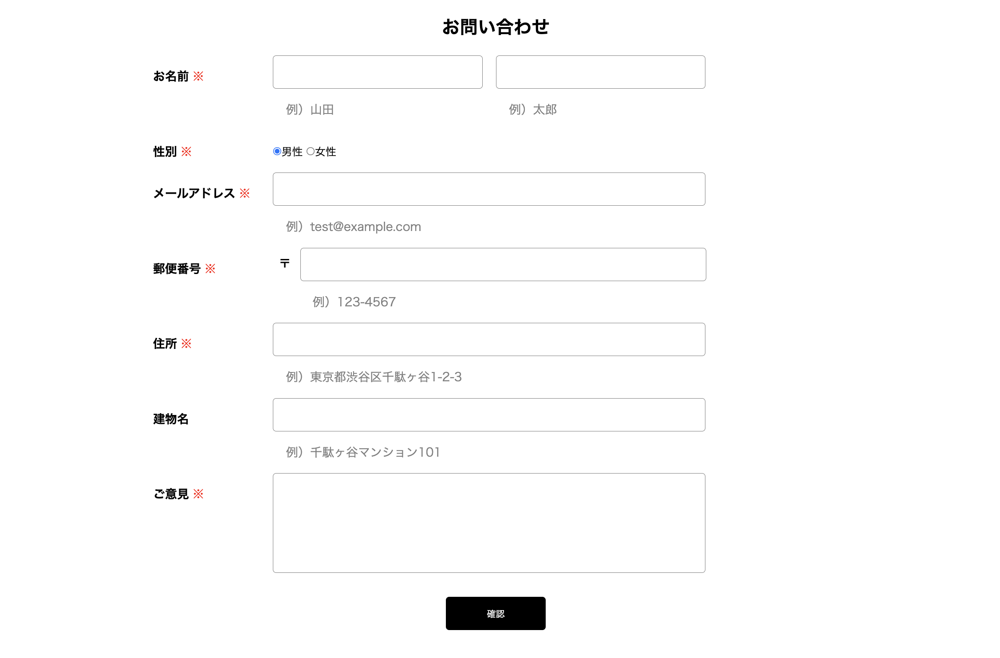

# 問い合わせフォーム

概要
問い合わせの入力フォームになります。

入力内容を確認後、送信ボタンを押すとデータベースに保存される仕組みになっていて、

管理システムではデータベースに保管されている入力者情報の検索・削除ができます。

  

## 作成の目的

自らの学習の理解度を確認する為

## 機能一覧
・問い合わせフォーム

  各項目へのバリデーション（入力時点でのバリデーション未実装）
  
    last-name（required,string,max:255）  →stringは機能していない
    first-name(required,string,max:255)  →stringは機能していない
    gender(required)  →デフォルトで男性にチェック対応の為、動作未確認
    email(required,email:rfc,dns)
    postcode(required,regex:/^\d{3}-\d{4}$/)　
    address(required,max:255)
    building_name(max:255)  →maxは機能していない
    content(required,max:120)
    
  バリデーション動作時の入力情報保持

・内容確認

  修正するボタンを押した際の入力情報保持（未実装）

・送信完了

  特になし

・管理システム

  検索機能（未実装）

  ページネーション

  削除機能

  意見の表示制限（未実装）

## 使用技術（実行環境）

  ー　Laravel 8.x

## テーブル設計

## ER図

